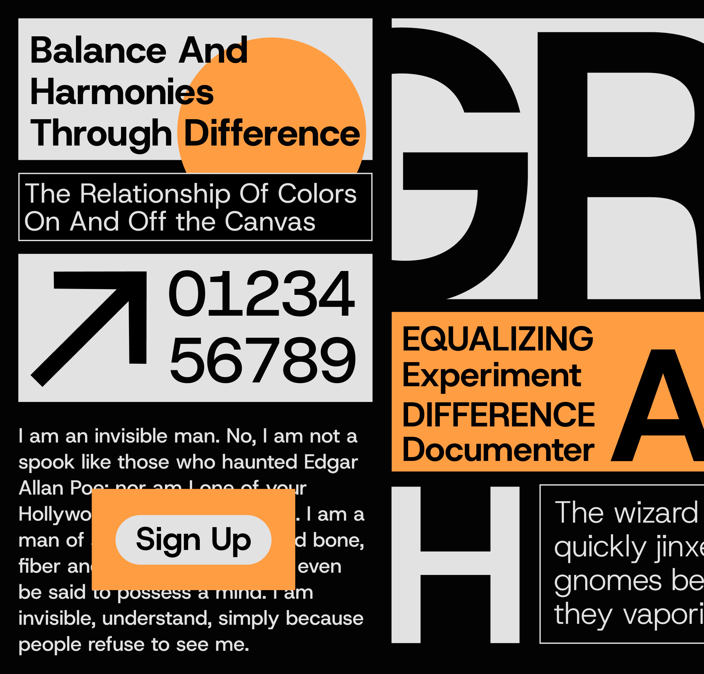

# Host Grotesk

[![][Fontbakery]](https://Element-Type.github.io/HostGrotesk/fontbakery/fontbakery-report.html)
[![][Universal]](https://Element-Type.github.io/HostGrotesk/fontbakery/fontbakery-report.html)
[![][GF Profile]](https://Element-Type.github.io/HostGrotesk/fontbakery/fontbakery-report.html)
[![][Outline Correctness]](https://Element-Type.github.io/HostGrotesk/fontbakery/fontbakery-report.html)
[![][Shaping]](https://Element-Type.github.io/HostGrotesk/fontbakery/fontbakery-report.html)

[Fontbakery]: https://img.shields.io/endpoint?url=https%3A%2F%2Fraw.githubusercontent.com%2FElement-Type%2FHostGrotesk%2Fgh-pages%2Fbadges%2Foverall.json
[GF Profile]: https://img.shields.io/endpoint?url=https%3A%2F%2Fraw.githubusercontent.com%2FElement-Type%2FHostGrotesk%2Fgh-pages%2Fbadges%2FGoogleFonts.json
[Outline Correctness]: https://img.shields.io/endpoint?url=https%3A%2F%2Fraw.githubusercontent.com%2FElement-Type%2FHostGrotesk%2Fgh-pages%2Fbadges%2FOutlineCorrectnessChecks.json
[Shaping]: https://img.shields.io/endpoint?url=https%3A%2F%2Fraw.githubusercontent.com%2FElement-Type%2FHostGrotesk%2Fgh-pages%2Fbadges%2FShapingChecks.json
[Universal]: https://img.shields.io/endpoint?url=https%3A%2F%2Fraw.githubusercontent.com%2FElement-Type%2FHostGrotesk%2Fgh-pages%2Fbadges%2FUniversal.json

Host Grotesk is a versatile uniwidth sans-serif typeface, offering both upright and italic variations across a range of weights. This typeface is meticulously crafted for optimal usage in user interfaces, by modifying and extending [Poppins](https://fonts.google.com/specimen/Poppins) by [Indian Type Foundry](https://www.indiantypefoundry.com), Jonny Pinhorn.

Image designed by [Güzin Türkeri](https://www.behance.net/guzinturkeri)

## About

Host Grotesk, designed by [Doğukan Karapınar](https://doughkan.com), a co-founder of Element Type. 

[Element Type](https://elementtype.co), based across İstanbul, Amiens, and Toronto, is a hub for innovative typeface design, font creation, and custom lettering. 

Mastering: [ibrahim kaçtıoğlu](http://ibrahimkactioglu.com).

## Building

Fonts are built automatically by GitHub Actions - take a look in the "Actions" tab for the latest build.

If you want to build fonts manually on your own computer:

* `make build` will produce font files.
* `make test` will run [FontBakery](https://github.com/googlefonts/fontbakery)'s quality assurance tests.
* `make proof` will generate HTML proof files.

The proof files and QA tests are also available automatically via GitHub Actions - look at https://Element-Type.github.io/HostGrotesk.

## Changelog

**14 August 2023. Version 1.00**
- Made Upright and Italic uniwidth
- Refined and redesigned drawings
- Updated character set to GF Latin Core.

**9 May 2024. Version 1.001**
- Bug fixes: Some glyphs had different width accros styles and weights.
- Reworked spacing.
- Reworked kerning.
- Drawing improvements.
- Tabular numbers, currency symbols.
- Tabular math symbols. They share same width but different than numbers and currencies.
- Removed `ℓ (U+2113)` and `₨ (U+20A8)`, as they were just place holders.
- Removed `Alternative Quotes` stylistic set that consists: `/comma.ss01/quotesinglbase.ss01/quotedblbase.ss01/quotedblleft.ss01/quotedblright.ss01/quoteleft.ss01/quoteright.ss01 ` as they were redundant.

## License

This Font Software is licensed under the SIL Open Font License, Version 1.1.
This license is available with a FAQ at
https://scripts.sil.org/OFL

## Repository Layout

This font repository structure is inspired by [Unified Font Repository v0.3](https://github.com/unified-font-repository/Unified-Font-Repository), modified for the Google Fonts workflow.
